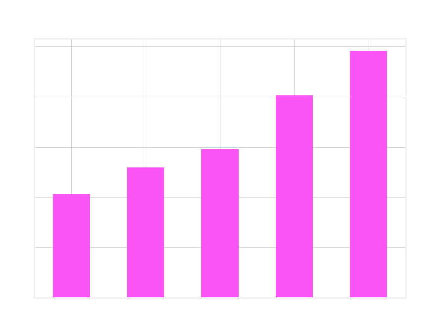
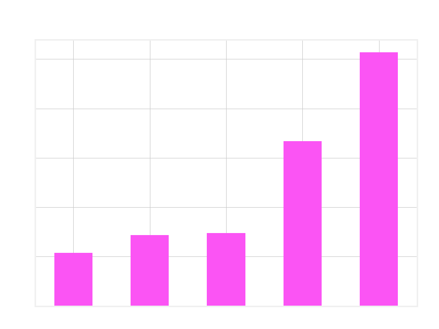
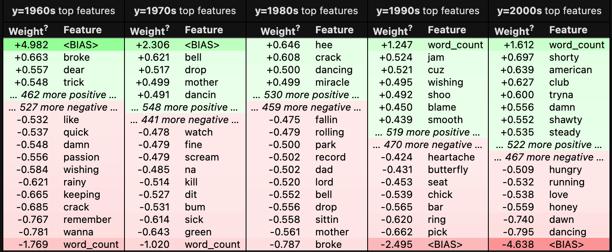

    <h1 align="center">Analysis of Song Lyrics</h1>

  
Table of Contents

  <ol>
<li><a href="#problem-statement">Problem Statement</a></li>
      <li><a href="#executive-summary">Executive Summary</a></li>
    <li><a href="#Data">Data</a></li>
      <li><a href="#getting-started">Getting Started</a></li>
        <li><a href="#prerequisites">Prerequisites</a></li>
        <li><a href="#installation">Installation</a></li>
    <li><a href="#license">License</a></li>
    <li><a href="#contact">Contact</a></li>
    <li><a href="#acknowledgments">Acknowledgments</a></li>
  </ol>

## Problem Statement

Can the lyrics of our most popular songs be used to determine which decade they were released?

 

## Executive Summary

This project involves analyzing the lyrics of Billboard Top 100 songs from 1960 to 2009 in order to predict which decade the song was released. The song and artist names were scraped from billboardtop100of.com. Once scraped, this data was used in conjunction with the Lyric Genius API in order to pull the lyrics for each song. The songs are genre agnostic and based solely on the top 100 most popular songs for each year.

Data cleaning largely involved correcting issues with the lyric pull from Genius. After inspection around 10% of songs had pulled erroneous text (classic novels, screenplays, poems, news articles, etc.) rather than lyics. These songs were identified and removed by capping the word count at 1,100 and removing all duplicate values from the dataset (erroneous lyrics tended to pull in for multiple songs). After removal we were left with 4,396 songs. Feature engineerint included adding a word count, sentiment score, average word length and an identifier of whether the song contained dirty or suggestive lyrics.

After EDA and prior to vectorization the most important features identified were word count and whether the song contained dirty lyrics. Average word count has more than doubled from the 1960s to the 2000s. 
 

There has been a similar rise in dirty / suggestive lyrics over this time period, with the number of suggestive songs rising from ~10% in the 1960s to over 50% in the 2000s.
 

The model with the highest accuracy was a boosted gradient classifier with a max depth of 3 and 200 estimators. Count vectorization was performed with an ngram range of (1,1) and 5,000 words. The model performed with 43.2% accuracy vs. a baseline model of 21.7%. 

### Process

### Models Used

* Boosted Gradient Classifier
* Logistic Regression
* Multinomial Naive Bayes

### Findings
Top performing features:

### Model Performance

The final model (Boosted Gradient Classifier) achieved a 43.2% accuracy score when predicting the decade the song reached the Billboard Top 100. This is compared to a baseline model of 21.7%.

 

###  Key Takeaways

* Word count has increased significantly over the decades.
* Lyrics are becoming far dirtier since the 1990s.
* A song can become dated by containing newly invented words, or as words fall out of use.
* Popular artists (with multiple singles in the top 100) are easier to classify. The assumption here is that our most popular artists are distinct and come to define a genre.
* Pop songs have an overwhelmingly positive sentiment on average, but negative sentiment has been increasing since the 1990s.
* Songs released near the turn of a new decade are more difficult to predict, as the culture evolves more gradually than the hard decade cutoff that the model employs.

### Next Steps

* Incorporate genre into the analysis.
* Expand the text used in the model to include other forms of writing such as novels and screenplays.

 

### Data

The data was originally scraped from the Billboard Top 100 website for song, artist name, and year. Then the Lyric Genius API was used to join the lyrics to the existing song data. Dataset can be found in the 'data' folder of this repo.

#### Data Dictionary

|  Feature |  Type |  Description |
|:-:|:-:|:-:|
|song_rank   |int64   |The position of the song on the Top 100.  |
|artist_name   |object   |Name of the artist or band. Will include featured artists as well. |
|song_title   |object  |The name of the song.  |
|year   |int64  |The year the song reached the Top 100.   |
|lyrics  |object   |The song lyrics,   |
|decade  |int64   |The decade the song reached the Billboard Top 100. Engineered based on the year.  |
|word_count  |int64   |The total word count of the lyrics. |
|characters  |int64   |The total character count in the lyrics.  |
|word_length  |float64   |The number of total characters divided by the number of words. Indicates average word length of the lyrics.   |
|profanity  |bool   |True if profanity or suggestive language is used in the lyrics.  |
|suggestive  |int64   |1 if profanity or suggestive language is used in the lyrics, else 0. |
|lyric_valence  |float64   |Float from 1 to -1. Positive numbers indicate positive sentiment, and negative scores indicate negative sentiment. |
|is_positive |int64   |1 if lyric_valence is greater than or equal to .5, else 0.  |
|is_negative  |int64   |1 if lyric_valence is less than or equal to -.5, else 0.   |
|is_nuetral  |int64   |1 if lyric_valence is between -.5 and -.5, else 0. |
|category_id  |int64   |Categorical variable based on the decade column.  |

 

### Getting Started

No installations are needed to use this project. Please refer to the [requirements.txt](https:) file to see python packages used in this project
## License

Distributed under the MIT License. See `LICENSE.txt` for more information.

<!-- CONTACT -->
### Contact
[Chad Richter](https://www.linkedin.com/in/chad-richter/) 

(<a href="#top">back to top</a>)

